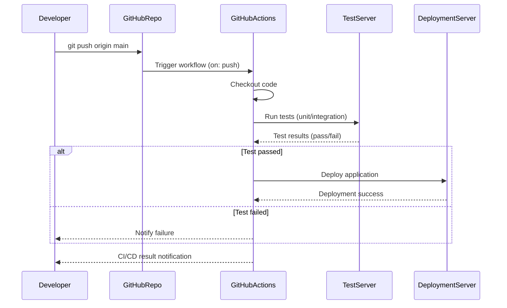

# software_engineering
3학년 2학기부터 졸업작품을 만들기 시작하여 4학년 1학기인 지금까지 계속 개발중에 있다. 
팀원들과의 협업을 위해 자연스럽게 GitHub를 사용하게 되었고, 팀원 협업의 능률이나 편리성을 위하여 사용하고 있고 실제로도 GitHub를 사용함으로써 팀원들과의 **소통 및 효율성**이 매우 올라간 것을 몸소 체감할 수 있었다.
하지만 이 GitHub가 자세하게 어떤 방식으로, 어떤 시스템을 구축하여 우리에게 도움을 주고 있는지에 대해서는 자세히 알지 못한 채, 그냥 협업을 위해 지금까지 쭉 사용해오고 있다. 그러다 이번 과제를 통해 GitHub의 **내부 시스템 구조**를 더 자세히 알고 싶다는 생각이 들었고, 해당 내용을 바탕으로 보고서를 작성하면 좋을 것 같다는 생각을 하게 되었다. 따라서 평소에 궁금했던 GitHub CI/CD. 즉, `개발자가 코드를 push 하면 GitHub Actions가 자동으로 테스트 및 배포를 수행하는 흐름`을 표현한 시퀀스 다이어그램 및 샘플 코드 작성, 그에 따른 모듈 평가를 작성해보았다.

# 1. 시퀀스 다이어그램


**해당 다이어그램을 간단하게 요약하자면,**
1. **Developer**가 `main` 브랜치에 코드를 푸시한다.
2. **GitHubRepo**는 `.github/workflows/*.yml`에 정의된 트리거 (`on: push')에 따라 GitHubActions를 실행한다.
3. **GitHubActions**는 코드를 체크아웃하고 테스트 서버에서 유닛/통합 테스트를 수행한다.
4. 테스트 결과에 따라 성공 시, 배포 서버로 배포 요청을 보내게 되고, 실패 시, 개발자에게 실패 사실을 알린다.
5. 최종적으로 **Developer**는 테스트/배포 성공 여부를 알림으로 받는다.

# 2. 해당 시퀀스 다이어그램에 따른 샘플 코드

``` python
import time
import random

class GitHubRepository:
    def __init__(self):
        self.workflow = GitHubActions()

    def receive_push(self, developer):
        print(f"[GitHubRepo] Received push from {developer.name}")
        self.workflow.trigger_workflow(developer)


class GitHubActions:
    def trigger_workflow(self, developer):
        print("[GitHubActions] CI/CD Workflow triggered by push event.")
        self.checkout_code()
        test_result = self.run_tests()

        if test_result:
            deployment_success = self.deploy()
            self.notify(developer, success=deployment_success)
        else:
            self.notify(developer, success=False)

    def checkout_code(self):
        print("[GitHubActions] Checking out repository code...")

    def run_tests(self):
        print("[GitHubActions] Running tests on TestServer...")
        time.sleep(1)
        result = random.choice([True, False])  # Random pass/fail
        print(f"[TestServer] Test {'PASSED' if result else 'FAILED'}")
        return result

    def deploy(self):
        print("[GitHubActions] Deploying to DeploymentServer...")
        time.sleep(1)
        success = random.choice([True, True, False])  # Slightly favor success
        print(f"[DeploymentServer] Deployment {'SUCCESS' if success else 'FAILED'}")
        return success

    def notify(self, developer, success):
        if success:
            print(f"[GitHubActions] CI/CD completed successfully. Notifying {developer.name}")
        else:
            print(f"[GitHubActions] CI/CD failed. Notifying {developer.name}")


class Developer:
    def __init__(self, name):
        self.name = name

    def push_code(self, repository):
        print(f"[Developer] {self.name} pushes code to GitHub.")
        repository.receive_push(self)


# === 실행 예시 ===
if __name__ == "__main__":
    dev = Developer("박태근")
    repo = GitHubRepository()

    dev.push_code(repo)

```

**실행 결과 예시**
```
[Developer] 박태근 pushes code to GitHub.
[GitHubRepo] Received push from 박태근
[GitHubActions] CI/CD Workflow triggered by push event.
[GitHubActions] Checking out repository code...
[GitHubActions] Running tests on TestServer...
[TestServer] Test PASSED
[GitHubActions] Deploying to DeploymentServer...
[DeploymentServer] Deployment SUCCESS
[GitHubActions] CI/CD completed successfully. Notifying 박태근
```

# 3. 모듈 평가 (응집도, 결합도)

### 응집도(Cohesion) 평가
- 응집도란?
응집도는 모듈 또는 클래스 내 구성 요소들이 얼마나 밀접하게 관련된 작업을 수행하는가를 나타낸다. 응집도가 높을수록 해당 클래스가 하나의 일관된 목적을 수행하며, 유지보수성이 좋다.

#### 클래스별 응집도 분석
1. `Developer` / **높음** / 한 가지 책임(코드 푸시)만 있음. 매우 응집력 있는 구조.

2. `GitHubRepository` / **보통 ~ 높음** / 외부로부터 푸시 요청을 받고, GitHubActions를 트리거하는 역할. 로직은 단순하나 역할은 명확.

3. `GitHubActions` / **낮음~중간** / checkout, 테스트 실행, 배포, 알림까지 다수 책임을 가짐. 하나의 클래스가 여러 기능을 담당하여 응집도가 낮음.

#### 개선 포인트:
`GitHubActions`는 SRP(단일 책임 원칙)를 위배하고 있으므로, 다음처럼 분해할 수 있다:
- `CodeCheckoutService`
- `TestRunner`
- `Deployer`
- `Notifier`

### 결합도(Coupling) 평가
- 결합도란?
결합도는 모듈 간 상호 의존 정도를 말한다. 결합도가 낮을수록 모듈 간 독립성이 높아지며, 변경에 유연하다.

#### 클래스 간 결합도 분석
1. `Developer → GitHubRepository` / **낮음** / 단순히 push_code()에서 receive_push() 호출. 역할이 명확하고 직접 의존성이 낮음.

2. `GitHubRepository → GitHubActions` / **중간** / 내부에 GitHubActions() 인스턴스를 직접 생성 (new). 이 부분은 **DI(의존성 주입)**을 통해 낮출 수 있음.

3. `GitHubActions → TestServer, DeploymentServer` / **중간~높음** / TestServer와 DeploymentServer가 실질적으로 독립 클래스가 아닌, 내부 메서드 수준으로 존재함 → 코드가 단단히 묶여 있음.

4. `GitHubActions → Developer` / **중간** / notify 메서드가 Developer 객체를 직접 참조하며 상태를 전달함. 메시징 시스템 등으로 추상화하면 결합도 더 낮출 수 있음.

#### 개선 포인트:

`GitHubActions`가 너무 많은 컴포넌트와 직접 연결됨 → 클래스 분리 + 인터페이스 기반 추상화 필요

생성자 주입 (`__init__(self, test_runner, deployer, notifier)`) 방식으로 의존성을 낮추는 것이 바람직


## 응집도 및 결합도 종합 평가
**응집도** / **불균형** / Developer, GitHubRepository는 높은 응집도. 반면 GitHubActions는 낮은 응집도.

**결합도** / **중간 수준** / 메서드 간 호출 중심으로 결합되어 있으며, 의존성 주입이 없는 구조. 변경에 취약함.


# 4. 모듈 평가 ( 모듈성, 책임 분리, 재사용성, 확장성, 테스트 가능성)

### 모듈성 (Modularity): 양호
클래스 단위로 `Developer`, `GitHubRepository`, `GitHubActions`의 책임이 분리되어 있음.
각 구성요소는 독립적으로 기능을 수행하며, 역할이 명확히 정의됨.

#### 장점: 테스트나 배포 로직을 별도 클래스로 나누기 쉬움.

#### 개선 포인트:
`TestServer`, `DeploymentServer`가 클래스가 아닌 내부 메서드로 표현되어 있어 역할 구분이 약간 모호함.
→ `TestServer`와 `DeploymentServer` 클래스로 분리 가능.

### 책임 분리 (Separation of Concerns): 준수
`Developer`는 단순히 코드를 푸시하는 역할만 수행.
`GitHubRepository`는 푸시 이벤트를 받고, `GitHubActions`를 호출.
`GitHubActions`는 테스트 및 배포의 모든 로직을 담당.

이는 실제 CI/CD 아키텍처의 구성과 유사하며, 의도된 시나리오 표현에는 적절함.

#### 개선 포인트:
`GitHubActions`가 너무 많은 책임(checkout, test, deploy, notify)을 가지고 있음.
- SOLID 원칙 중 **단일 책임 원칙(SRP)**에 어긋날 수 있음.
- → `TestRunner`, `Deployer`, `Notifier` 등을 별도 클래스로 위임할 수 있음.

### 재사용성 (Reusability): 보통
각 클래스는 다른 컨텍스트에서도 재사용 가능한 구조이나, 내부 구현이 간단한 `print()` 중심이라 재사용 범위가 제한됨.

#### 개선 시나리오:
`GitHubActions` 내의 `run_tests`, `deploy`, `notify`를 실제 프로덕션/테스트 환경에서 재사용하려면,
- 외부 의존성을 주입하거나
- 환경 설정 파일 또는 인터페이스 기반 설계로 리팩터링 필요

### 확장성 (Extensibility): 우수
현재 구조는 다음과 같은 기능 확장이 용이함:
- Slack, Email 등 알림 채널 추가
- 테스트 단계 구체화 (예: lint → unit test → e2e test)
- 환경별 배포 로직 추가 (staging, production)

구조적으로 클래스와 메서드 기반으로 잘 분리되어 있어, 변화에 유연하게 대응할 수 있음.

### 테스트 가능성 (Testability): 중간
현재 로직은 `print()`로만 결과를 표현하기 때문에 유닛 테스트나 시뮬레이션이 어려움.
랜덤 테스트/배포 결과 (`random.choice`)도 결정적 테스트 불가의 원인이 됨.

#### 개선 제안:
- `random`을 의존성으로 주입 (e.g. `RandomGenerator` 클래스)
- `Logger`나 `Notifier`를 추상화하여 모의(mock) 가능하도록 설계
