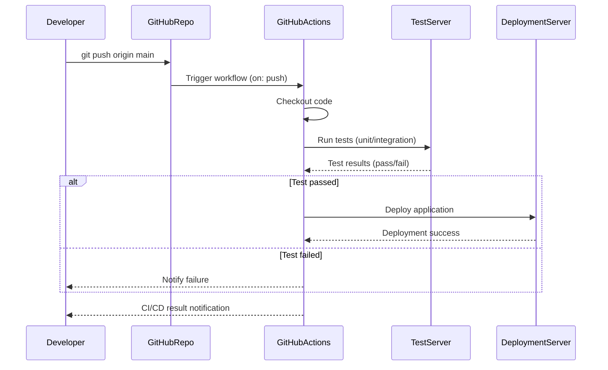

# software_engineering
3학년 2학기부터 졸업작품을 만들기 시작하였다. 팀원들과의 협업을 위해 자연스럽게 GitHub를 사용하게 되었다. 팀원 협업의 능률이나 편리성을 위하여 사용하고 있지만, 이 GitHub가 어떤 방식으로, 어떻게 우리에게 도움을 주고 있는지에 대해서는 자세히 알아보지 않은 채, 그냥 협업을 위해 지금까지 쭉 사용해왔다. 따라서 이번 과제를 통해 시스템 구조나 어떠한 방식으로 작동하는지 자세히 알아보려 한다.

해당 다이어그램을 간단하게 요약하자면,
1. `Developer`가 코드를 수정한다.
2. git add  및 git commit을 통해 로컬에 저장한다.
3. git push 명령어로 원격 저장소(GitHub)에 전송한다.
4. LocalGit이 GitHubRepo에 데이터를 전송한다. (보통 HTTPS나 SSH 경로로)
5. GitHub는 요청을 수락하고 응답을 돌려준다.
6. 로컬은 성공 여부를 Developer에게 알려준다.

7. 
