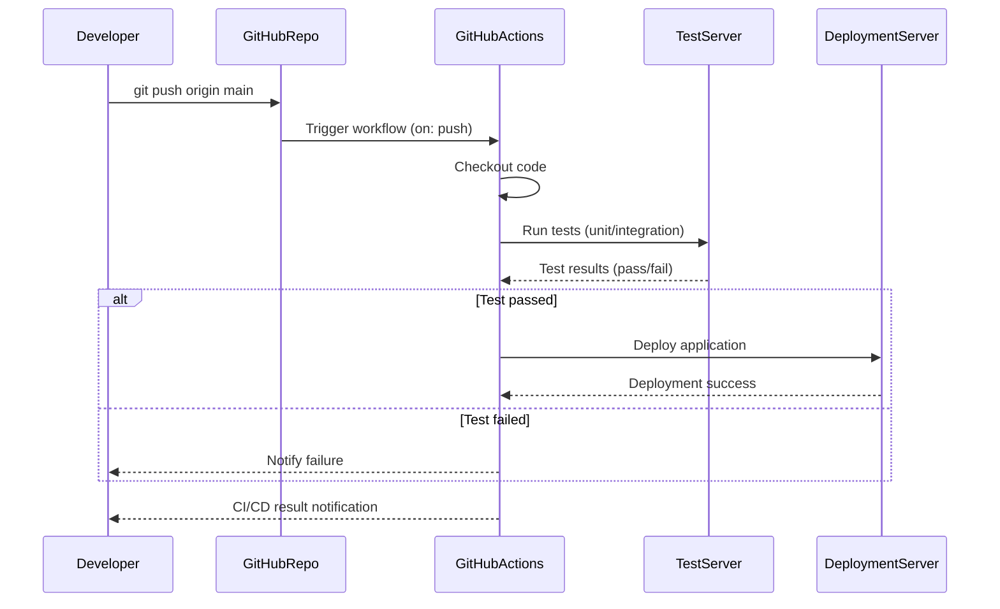

# software_engineering
3학년 2학기부터 졸업작품을 만들기 시작하였다. 팀원들과의 협업을 위해 자연스럽게 GitHub를 사용하게 되었다. 팀원 협업의 능률이나 편리성을 위하여 사용하고 있지만, 이 GitHub가 어떤 방식으로, 어떻게 우리에게 도움을 주고 있는지에 대해서는 자세히 알아보지 않은 채, 그냥 협업을 위해 지금까지 쭉 사용해왔다. 따라서 이번 과제를 통해 시스템 구조나 어떠한 방식으로 작동하는지 자세히 알아보려 한다.

